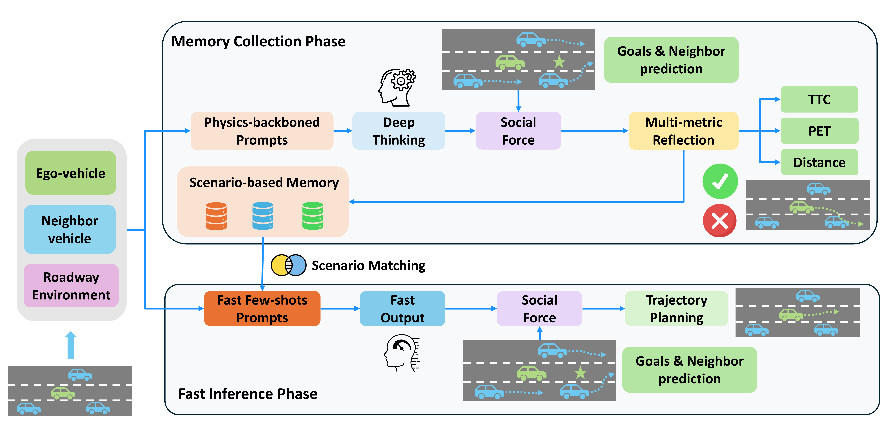
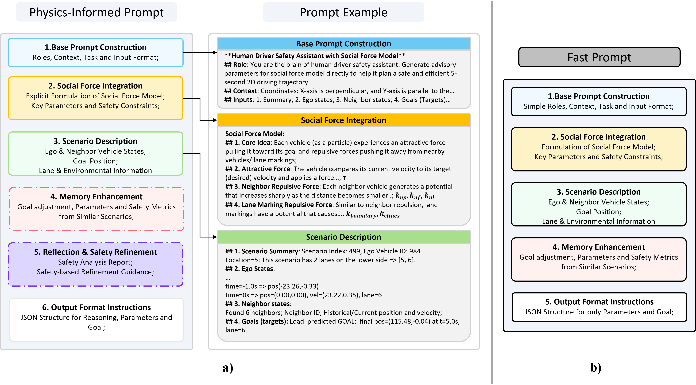
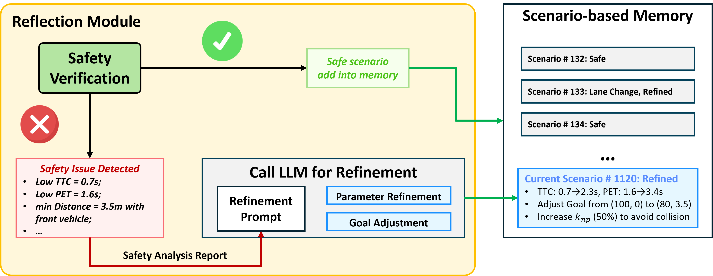

# LetsPi: Planning Safety Trajectories with Dual-Phase, Physics-Informed, and Transportation Knowledge-Driven Large Language Models
This repository contains the manuscript and materials for the paper "Planning Safety Trajectories with Dual-Phase, Physics-Informed, and Transportation Knowledge-Driven Large Language Models"

## Abstract: 
Foundation models have demonstrated strong reasoning and generalization capabilities in driving-related tasks, including scene understanding, planning, and control. However, they still face challenges in hallucinations, uncertainty, and long inference latency. While existing foundation models have general knowledge of avoiding collisions, they often lack transportation-specific safety knowledge. To overcome these limitations, we introduce LetsPi, a physics-informed, dual-phase, knowledge-driven framework for safe, human-like trajectory planning. To prevent hallucinations and minimize uncertainty, this hybrid framework integrates Large Language Model (LLM) reasoning with physics-informed social force dynamics. LetsPi leverages the LLM to analyze driving scenes and historical information, providing appropriate parameters and target destinations (goals) for the social force model, which then generates the future trajectory. Moreover, the dual-phase architecture balances reasoning and computational efficiency through its Memory Collection phase and Fast Inference phase. The Memory Collection phase leverages the physics-informed LLM to process and refine planning results through reasoning, reflection, and memory modules, storing safe, high-quality driving experiences in a memory bank. Surrogate safety measures and physics-informed prompt techniques are introduced to enhance the LLM's knowledge of transportation safety and physical force, respectively. The Fast Inference phase extracts similar driving experiences as few-shot examples for new scenarios, while simplifying input-output requirements to enable rapid trajectory planning without compromising safety. Extensive experiments using the HighD dataset demonstrate that LetsPi outperforms baseline models across five safety metrics. Ablation studies further confirm that the dual-phase design achieves superior results compared to direct few-shot approaches while significantly reducing inference time.

## Table of Contents
- [Abstract](#abstract)
- [Figures](#figures)
- [Code](#code)
- [License](#license)

## Figures

### Figure 1

**Figure 1 Description (Placeholder)**: *LetsPi, a dual-phase, physics-informed LLM architecture for safe trajectory planning. The memory collection phase builds the knowledge database through in-depth reasoning and reflection using multiple safety metrics. The fast inference phase distills knowledge from the memory database, enabling timely trajectory planning.*

### Figure 2

**Figure 2 Description (Placeholder)**: *a) Physics-informed Prompt Architecture. Essential components include base prompt construction, social force integration, scenario description, and output instruction. Two optional prompts are used for memory enhancement and refinement. b) Fast Prompt Architecture. Without reflection and safety refinement,  Fast Prompt comprises simplified base prompt construction, social force integration, scenario description components and minimalistic output requirement with dedicated examples from memory.*

### Figure 3

**Figure 3 Description (Placeholder)**: *Reflection Module workflow.*

## Code
Coming soon — We will upload the code onece the paper review is completed.
